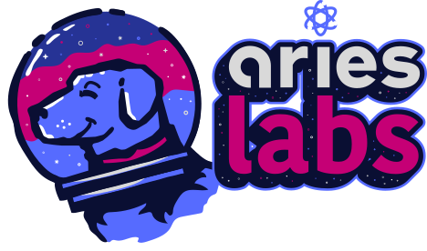

<!-- markdownlint-disable MD041 -->
<!-- markdownlint-disable MD033 -->

  

# commercetools Emailer

## Overview

For digital commerce keeping customers informed is critical. This keeps customers happy and minimizes customer service requests. A key aspect of this communication is automated transactional emails, some examples include order confirmations, password resets, and shipping updates.

Aries created this commercetools emailer to tackle this requirement with an event-driven MACH approach. This application empowers users to create, edit, and manage email templates using a drag-and-drop editor. These templates are then used in the email event processor to send event-driven eCommerce emails.

### Key features

- Creating new email templates.
- Modifying templates with a user-friendly drag-and-drop editor.
- Managing templates for various transactional email types, such as order confirmations or password resets.

This projects allows businesses to manage their transactional emails directly without requiring code changes.

## Getting Started

View the [documentation](https://ariessolutionsio.github.io/commercetools-emailer/) or reach out to [Aries Solutions](https://www.ariessolutions.io/) for [support](https://www.ariessolutions.io/contact-aries/).

## Contributing

Contributions are welcome! Please feel free to submit pull requests or open issues to discuss proposed changes or report bugs.

For major changes, please open an issue first to discuss what you would like to change. Ensure to update tests as appropriate.

## License

This source code is provided under the [GNU AGPLv3 license](https://www.gnu.org/licenses/agpl-3.0.en.html).

All work product released in this repository is provided ​“AS IS”. We makes no other warranties, express or implied, and hereby disclaims all implied warranties, including any warranty of merchantability and warranty of fitness for a particular purpose. The demo provided is for testing purposes only, does not include any form of SLA, and should not be used in a production environment.

If you would like to discuss alternative licensing or leveraging this application in your composable stack, please [reach out to Aries Solutions](https://www.ariessolutions.io/contact-aries/) to discuss options.

----

# [Aries Labs](https://www.ariessolutions.io/)

This project is part of the Aries Labs initiative. To learn more about Aries Solutions and other projects including the MACH Booster please visit our website
