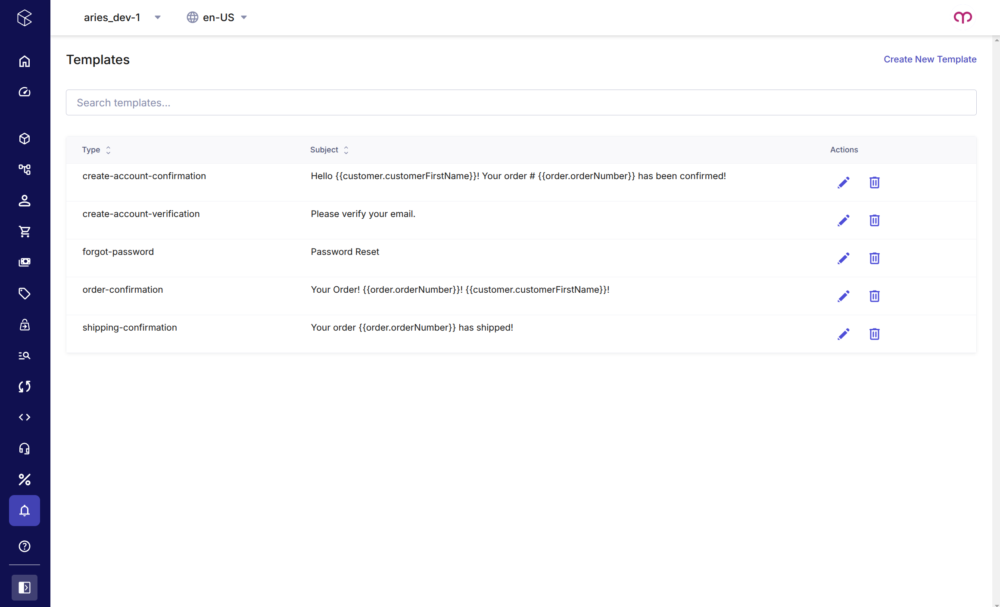

<!--prettier-ignore-start-->
# commercetools Emailer

Assist your customers directly from the Merchant Center.
{: .fs-6 .fw-300 }

_NOTE: If you need help implementing or customizing this application, please [reach out](https://www.ariessolutions.io/contact-aries/) with any questions._

[Get started now](/installing.html){: .btn .btn-primary .fs-5 .mb-4 .mb-md-0 .mr-2 } [View it on GitHub](https://github.com/ariessolutionsio/shop-assist){: .btn .fs-5 .mb-4 .mb-md-0 }

---

## Features

### Template List

You can manage your email templates directly from the commercetools merchant center. After opening the application you will be able to view the full list of emails configured, search for templates, delete templates, create new templates, or select a template to edit.

### Template Edits

The template editor provides a streamlined interface to manage all aspects of your email communications. The editing process follows three simple steps:

#### 1. Select Email Type
Choose which commercetools event will trigger your email. Available events include:

- Account Verification
- Account Confirmation
- Forgot Password
- Order Confirmation
- Shipping Confirmation

**Note:** Each event type can have only one active template. Previously created templates for a specific type will be disabled in the selection menu to prevent duplicates.

    <video controls style="max-width: 100%;">
        <source src="assets/select-email-type.webm" type="video/webm">
        Your browser does not support the video tag.
    </video>

#### 2. Create Subject Line
Craft your email subject with dynamic personalization. The editor offers:

- Real-time preview of your subject line
- Tag insertion button for available data fields
- Automatic customization based on your commercetools data model

    <video controls style="max-width: 100%;">
        <source src="assets/subject-line.webm" type="video/webm">
        Your browser does not support the video tag.
    </video>

#### 3. Build Email Content
Design responsive email bodies using our intuitive drag-and-drop editor powered by [MJML](https://mjml.io/):

- Drag content blocks onto your canvas
- Customize styling and content for each element
- Insert dynamic data tags identical to those in subject lines
- Preview your design on both desktop and mobile views

Our templates render correctly across all major email clients including Outlook, Gmail, Apple Mail, and Yahoo Mail on desktop and mobile platforms.

    <video controls style="max-width: 100%;">
        <source src="assets/editor.webm" type="video/webm">
        Your browser does not support the video tag.
    </video>

### Sending

The emailer backend watches for specific commercetools events and will send the template merged with the customer data. For example, when an order is placed an order confirmation email will automatically be triggered.

The backend can be hosted on commercetools connect or any cloud supported by commercetools subscriptions. Emails can be delivered through:

- An SMTP Server
- Sendmail
- Amazon SES
- Brevo
- MailGun
- SendGrid
- MailJet
- Any SMTP compatible service.

If you need a different transport option that can be easily added.